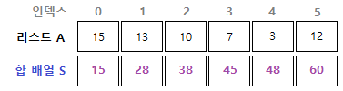

# log-Algorithm Practice
Practice algorithm

## 1. 코딩 테스트 준비하기

### 01 시간 복잡도 ; 알고리즘 선택의 기준

#### 01-1 시간 복잡도의 표기법
- 1초 => 약 2000만 번의 연산 (in 파이썬)
##### 시간 복잡도의 정의
- 시간 복잡도의 유형
    - 빅-오메가 : '최선'의 연산
    - 빅-세타 : '보통'의 연산
    - 빅-오 : '최악'의 연산
- 코딩 테스트에서 사용하는 시간 복잡도 => '빅-오 표기법(O(n))'

#### 01-2 시간 복잡도의 활용
##### 1) as 알고리즘 선택의 기준
- 알고리즘들의 시간 복잡도를 알고 있다면, 문제에서 주어진 시간 제한 + 데이터 크기를 바탕으로 가능한 알고리즘들 중 가장 적합한 알고리즘을 선택 가능
##### 2) as 코드 로직 개선
- 시간 복잡도 도출 기준
    - ⓐ 상수 => 시간 복잡도 계산에서 제외
    - ⓑ 가장 많이 중첩된 반복문의 수행 횟수 => 시간 복잡도의 기준

### 02 디버깅 스킬 ; 코드의 논리 오류 잡아내기

#### 02-1 디버깅의 중요성
- 논리 오류 <-> 문법 오류(corrected by 컴파일러)
- 디버깅 => 코딩 테스트 시 '반드시' 해야하는 과정
##### 디버깅의 방법
- ① 중단점(break point) 설정
  - 코드에서 디버깅하고자 하는 줄에 적용
  - 중단점 여러 개 설정 가능
- ② IDE의 디버깅 기능 실행 => PyCharm의 Variables 기능
  - 코드 1줄씩, 또는, 다음 중단점까지 실행 가능
  - 추적할 '변수값' 지정 가능
  - '수식'을 입력해 논리 오류 파악 가능

#### 02-2 디버깅의 활용 사례
##### 실수하기 쉬운 오류들 (4가지)
- 오류_1) 변수 초기화 오류
- 오류_2) 반복문에서의 인덱스 범위 지정 오류
- 오류_3) 잘못된 변수 사용 오류
- 오류_4) 파이썬 자동 형 변환 -- 유의

## 2. 코딩 테스트 -- Basic

### 03 자료구조
- 자료구조 : 데이터를 효율적으로 저장, 접근, 수정하기 위한 그릇
- 주어진 입력 데이터의 형태 & 사용할 알고리즘 --> 적절한 자료구조 선정 必

#### 03-1 배열 & 리스트
- 컴퓨터공학에서 말하는 배열 & 리스트는 비슷하지만 엄연히 다른 특징을 가지는 자료구조
  - 배열
  - 리스트
- BUT in 파이썬, 배열과 리스트를 구분하지 않음!

> 001. [bronze-4] 숫자의 합 구하기
> - 리스트
> - 학습 내용
>   - numbers = list(input())
>     - numbers 변수에 list 함수를 이용하여 숫자를 한 자리씩 나누어 받을 수 있음

##### 파이썬에서의 형 변환
- => int, float, str, chr, bool
- 이때, bool의
  - True => 0이 아닌 수, 값이 존재하는 경우
  - False => 0, 값이 비어있는 경우

> 002. [bronze-1] 평균 구하기
> - 리스트
> - 학습 내용
>   - print(round(new_sum/n, 6))
>     - 소수점 자릿수 제한
>     - 소수점 자릿수가 6자리 이상이면 => 6자리까지만 출력 / 소수점 자릿수가 6자리 미만이면 => 6자리까지 말고 그 자릿수까지만 출력되도록 함
>   - 수학 식의 경우, 정말 곧이곧대로 사용하기보다는 코드로 쳤을 때 "더 효율적"일 수 있도록 식을 약간 변형해주자
>   - sum() 함수
>     - 바로 '리스트의 총합' 구해버릴 수 있음

#### 03-2 구간 합
- '합 배열' --> 시간 복잡도 ↓ (O(n) -> O(1))
- 

> 003. [silver-3] 구간 합 구하기 1
> - 합 배열 --> 구간 합
> - 학습 내용
>   - `input = sys.stdin.readline`
>     - 이 코드의 유무만으로 '시간초과'와 '맞았습니다'가 결정됨
>     - 입력 속도 : 일반 input() <<<<< sys.stdin.readline()

> 004. [silver-1] 구간 합 구하기 2
> - 합 배열의 확장 ; 1차원 -> 2차원
> - 학습 내용
>   - list끼리의 '+' 연산
>   - 일단 (n+1)*(n+1) 테이블의 '맨 첫 행만' 설정한 뒤, 맨 첫 행 이후의 행들은 append를 하는 방식으로 원본 테이블 table_data를 입력 받을 수 있다.
>     - `table_data = [[0] * (n+1)] \
for i in range(n): row_data = [0] + [int(x) for x in input().split()] \
table_data.append(row_data)`
>   - 수학적인 공식 패턴 有

#### 03-3 투 포인터
#### 03-4 슬라이딩 윈도우
#### 03-5 스택 & 큐

### 04 정렬

### 05 탐색

### 06 그리디

### 07 정수론